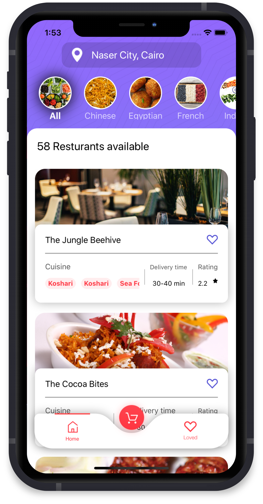
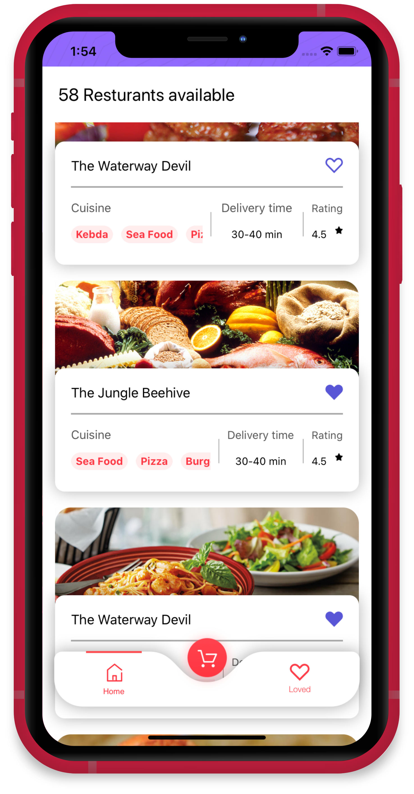
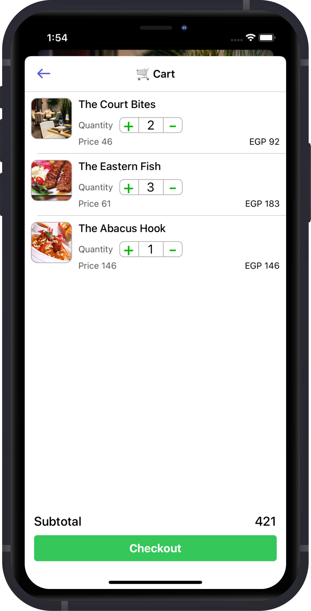
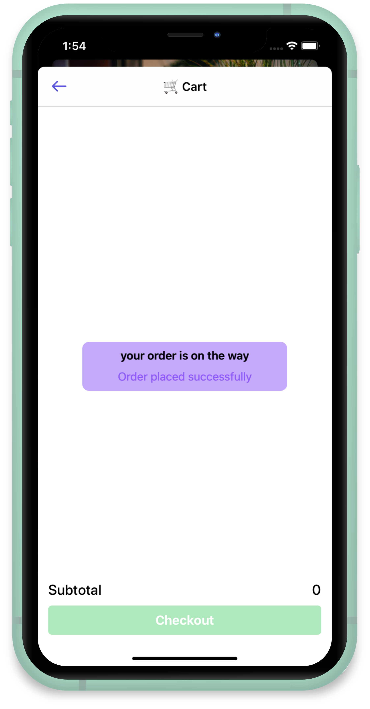
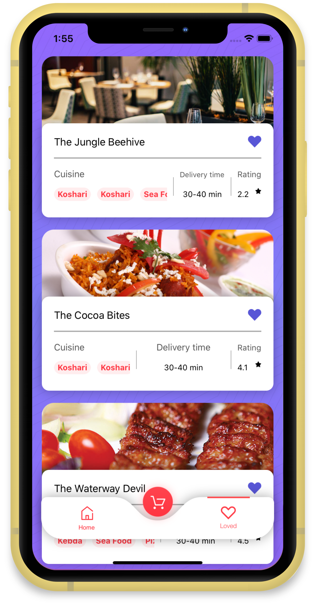

## Food Delivery
 
  

an iOS app that fetch restaurants from API and let the user order the meals he/she want 

**using:** 
 - Alamofire
 - Toast-Swift
 - Kingfisher
 - SkeletonView
 - custom tabBar
 

  

  

> I've created this app while in CodeZilla iOS workshop - Oct 2019
